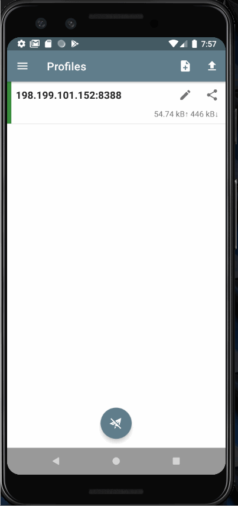

## [Shadowsocks](https://shadowsocks.org) for Android
Shadowsocks is a secure [socks5](https://en.wikipedia.org/wiki/SOCKS#SOCKS5) proxy, designed to protect your Internet traffic.  It is available on multiple platforms, but this repository is for the Android platform specifically.  Before installing Shadowsocks, please read our [privacy policy](https://github.com/shadowsocks/shadowsocks-android/blob/master/privacy_policy.md).

for Android & Chrome OS ([beta](https://play.google.com/apps/testing/com.github.shadowsocks))  

for Android TV ([beta](https://play.google.com/apps/testing/com.github.shadowsocks.tv))

### PREREQUISITES

* [JDK 1.8](https://www.oracle.com/java/technologies/javase/javase-jdk8-downloads.html):  Java Development Kit
* [Android SDK](https://developer.android.com/studio):  Android Software Development Kit - NOTE: SDK included in Android Studio download or can be downloaded individually at the bottom of the linked page)
  - [Android NDK](https://developer.android.com/ndk/downloads):  The Native Development Kit is a set of tools that allows you to use C and C++ code with Android, and provides platform libraries you can use to manage native activities and access physical device components, such as sensors and touch input.
* Rust with Android targets installed: The below command will install Rust from the official release channels 
  `$ rustup target install armv7-linux-androideabi aarch64-linux-android i686-linux-android x86_64-linux-android`

### BUILD

You can check whether the latest commit builds under UNIX environment by checking Travis status.

* Install prerequisites
* Clone the repo using `git clone --recurse-submodules <repo>` or update submodules using `git submodule update --init --recursive`
* Build it using Android Studio or gradle script

### BUILD WITH DOCKER

* Clone the repo using `git clone --recurse-submodules <repo>` or update submodules using `git submodule update --init --recursive`
* Run `docker run --rm -v ${PWD}:/build -w /build shadowsocks/android-ndk-go ./gradlew assembleDebug`

### CONTRIBUTING

If you are interested in contributing or getting involved with this project, please read the [CONTRIBUTING](https://github.com/shadowsocks/shadowsocks-android/blob/master/CONTRIBUTING.md) page for more information.

### TRANSLATION
If you are interested in helping to translate Shadowsocks, please read the [translation guide](https://discourse.shadowsocks.org/t/poeditor-translation-main-thread/30) for more information.  We are also looking for translation proofreaders.

### LICENSE

This project is licensed under the GNU General Public license and can be read [here](https://github.com/shadowsocks/shadowsocks-android/blob/master/LICENSE).

This project also makes use of several other open source projects.  Their licenses are linked below:
<ul>
    <li>redsocks: <a href="https://github.com/shadowsocks/redsocks/blob/shadowsocks-android/README">APL 2.0</a></li>
    <li>libevent: <a href="https://github.com/shadowsocks/libevent/blob/master/LICENSE">BSD</a></li>
    <li>tun2socks: <a href="https://github.com/shadowsocks/badvpn/blob/shadowsocks-android/COPYING">BSD</a></li>
    <li>shadowsocks-rust: <a href="https://github.com/shadowsocks/shadowsocks-rust/blob/master/LICENSE">MIT</a></li>
    <li>libsodium: <a href="https://github.com/jedisct1/libsodium/blob/master/LICENSE">ISC</a></li>
    <li>OpenSSL: <a href="https://www.openssl.org/source/license-openssl-ssleay.txt">OpenSSL License</a></li>
</ul>